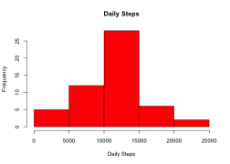
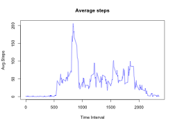
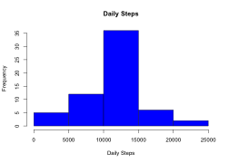
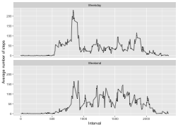

### Activity Monitoring Peer-graded Assignment


####1) Read activity file into data frame that has following columns: steps, date and interval. Date is also formated.

```r
Activity <- read.csv("activity.csv")
Activity$date <- as.character(Activity$date)
Activity$date <- ymd(Activity$date)
```
####2) Histogram of the total number of steps taken each day

```r
Act_Hist <- Activity %>% group_by(date) %>% summarise(st = sum(steps))
#graphics.off()
hist(Act_Hist$st,xlab = "Daily Steps", main = "Daily Steps", col = "RED")
```



####3) Mean and Median steps taken each day

```r
summary(Act_Hist)
```

```
##       date                  st       
##  Min.   :2012-10-01   Min.   :   41  
##  1st Qu.:2012-10-16   1st Qu.: 8841  
##  Median :2012-10-31   Median :10765  
##  Mean   :2012-10-31   Mean   :10766  
##  3rd Qu.:2012-11-15   3rd Qu.:13294  
##  Max.   :2012-11-30   Max.   :21194  
##                       NA's   :8
```

####4) Time series plot of the average number of steps taken
Make a time series plot (i.e.type="l") of the 5-minute interval (x-axis) and the average number of steps taken, averaged across all days (y-axis)

```r
Act_Avg <- aggregate(Activity$steps~Activity$interval,Activity,mean)
plot(Act_Avg$`Activity$steps`~Act_Avg$`Activity$interval`, type="l", xlab = "Time Interval", ylab = "Avg.Steps",main = "Average steps", col = "blue")
```



####5) The 5-minute interval that, on average, contains the maximum number of steps

```r
Act_Avg[which.max(Act_Avg$`Activity$steps`),]
```

```
##     Activity$interval Activity$steps
## 104               835       206.1698
```
####6) Code to describe and show a strategy for imputing missing data.
Let's check NA's in the data set


```r
colSums(is.na(Activity))
```

```
##    steps     date interval 
##     2304        0        0
```
There are 2304 missing(NA) values in steps column of the data set Activity. Let's replace column 'Step' missing(NA) values with mean for time-interval average.

```r
ImpActivity <- Activity
for(i in 1:nrow(ImpActivity)){
    if (is.na(ImpActivity$steps[i])){
        inter <- ImpActivity$interval[i]
        capstep <- Act_Avg[Act_Avg$`Activity$interval`==inter,]
        ImpActivity$steps[i] <- capstep$`Activity$steps`
    }
}
```
####7) Histogram of the total number of steps taken each day after missing values are imputed.

```r
ImpHist <- ImpActivity %>% group_by(date) %>% summarise(st = sum(steps))
#graphics.off()
hist(ImpHist$st,xlab = "Daily Steps", main = "Daily Steps", col = "blue")
```



####8) Mean and Median steps taken each day after values are imputed. There clearly are differences in median, first and third quantile values.

```r
summary(ImpHist)
```

```
##       date                  st       
##  Min.   :2012-10-01   Min.   :   41  
##  1st Qu.:2012-10-16   1st Qu.: 9819  
##  Median :2012-10-31   Median :10766  
##  Mean   :2012-10-31   Mean   :10766  
##  3rd Qu.:2012-11-15   3rd Qu.:12811  
##  Max.   :2012-11-30   Max.   :21194
```

####9) Panel plot comparing the average number of steps taken per 5-minute interval across weekdays and weekends

```r
ImpHistWD <- ImpActivity %>% mutate(Wtype = if_else(weekdays(as.Date(ImpActivity$date)) %in% c('Saturday','Sunday'),"Weekend","Weekday"))
ImpHistWD$Wtype <- as.factor(ImpHistWD$Wtype)

Dail_Avg <- aggregate(ImpHistWD$steps~ImpHistWD$interval+ImpHistWD$Wtype,ImpHistWD,mean)
#graphics.off()
ggplot(Dail_Avg,aes(x=Dail_Avg$`ImpHistWD$interval`,y=Dail_Avg$`ImpHistWD$steps`),color=`Weekday or Weekend`) +  geom_line() + facet_wrap(.~Dail_Avg$`ImpHistWD$Wtype`, nrow = 2) + xlab("Interval") + ylab("Average number of steps") 
```



*############   Session info for package and other details #############*

```r
sessionInfo()
```

```
## R version 3.6.0 (2019-04-26)
## Platform: x86_64-apple-darwin15.6.0 (64-bit)
## Running under: macOS High Sierra 10.13.6
## 
## Matrix products: default
## BLAS:   /Library/Frameworks/R.framework/Versions/3.6/Resources/lib/libRblas.0.dylib
## LAPACK: /Library/Frameworks/R.framework/Versions/3.6/Resources/lib/libRlapack.dylib
## 
## locale:
## [1] en_US.UTF-8/en_US.UTF-8/en_US.UTF-8/C/en_US.UTF-8/en_US.UTF-8
## 
## attached base packages:
## [1] stats     graphics  grDevices utils     datasets  methods   base     
## 
## other attached packages:
## [1] dplyr_0.8.1     magrittr_1.5    ggplot2_3.2.0   lubridate_1.7.4
## 
## loaded via a namespace (and not attached):
##  [1] Rcpp_1.0.1       rstudioapi_0.10  knitr_1.23       tidyselect_0.2.5
##  [5] munsell_0.5.0    colorspace_1.4-1 R6_2.4.0         rlang_0.3.4     
##  [9] stringr_1.4.0    tools_3.6.0      grid_3.6.0       gtable_0.3.0    
## [13] xfun_0.7         withr_2.1.2      htmltools_0.3.6  assertthat_0.2.1
## [17] yaml_2.2.0       lazyeval_0.2.2   digest_0.6.19    tibble_2.1.3    
## [21] crayon_1.3.4     purrr_0.3.2      glue_1.3.1       evaluate_0.14   
## [25] rmarkdown_1.13   labeling_0.3     stringi_1.4.3    compiler_3.6.0  
## [29] pillar_1.4.1     scales_1.0.0     pkgconfig_2.0.2
```
